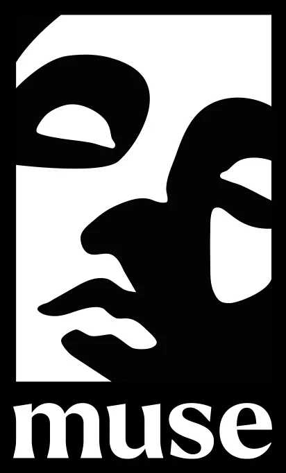

# Muse Landing

Ladies and gentlemen, this is my first frontend test assignment for a tech company,
and I have only 50% confidence that I
understand what is being discussed.
The remaining 50% is just confidence that I can convince you that everything is
going according to plan :)
I hope that at least the second half is correct!
:)

This is landing including the following features:
* Desktop and mobile versions
* Client-side form validation

[comment]: <> (Сверстать адаптивно любым предпочитаемым способом)
[comment]: <> (Сделать валидацию email-поля по клику кнопки формы и по нажатию кнопки Enter)
[comment]: <> (Показывать alert "Welcome to the team!", если валидация прошла успешно)
[comment]: <> (Показывать alert "Email is invalid", если валидация прошла неуспешно)
[comment]: <> (Залить код в публичный Github репозиторий)
[comment]: <> (Задеплоить результат на Github Pages)
[comment]: <> (Прислать ссылку на репозиторий и на сайт)
[comment]: <> (На выполнение задания дается 7 календарных дней. Удачи!)
